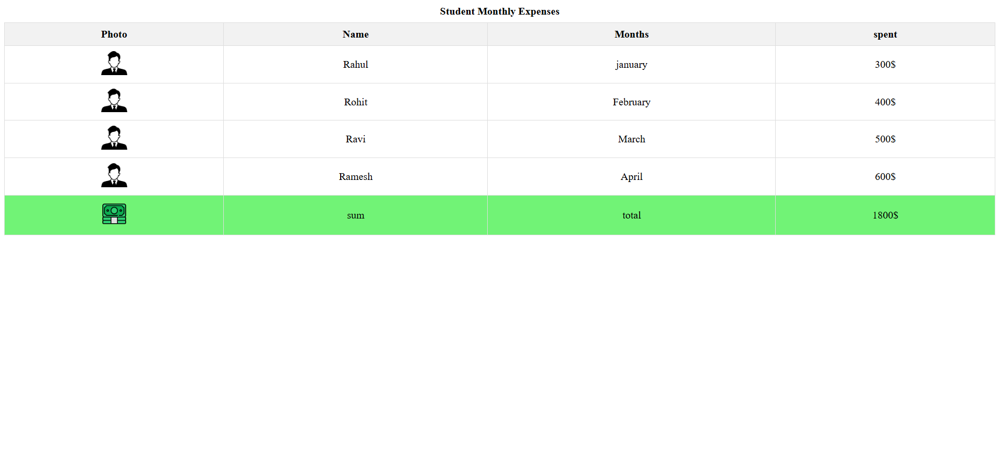

# Student Expense Table

A simple HTML project to track student monthly expenses using a basic table layout.

## 📌 Features
- Clean table with photo, name, month, and amount spent
- Total sum calculation at the bottom
- Beginner-friendly HTML and CSS structure
- Great for practicing table design and basic styling

## 💻 Built With
- HTML
- CSS (optional)

## 📷 Preview

## 📁 How to Use
1. Clone the repository
2. Open `index.html` in your browser
3. View and edit the table as per your data

## 🧠 Why I Made This
I'm currently learning web development, and this is one of my early practice projects. The goal was to get comfortable with HTML tables and basic structure.

---

📅 Created: July 2025  
👨‍🎓 By: Shibudas (Beginner Web Developer)
